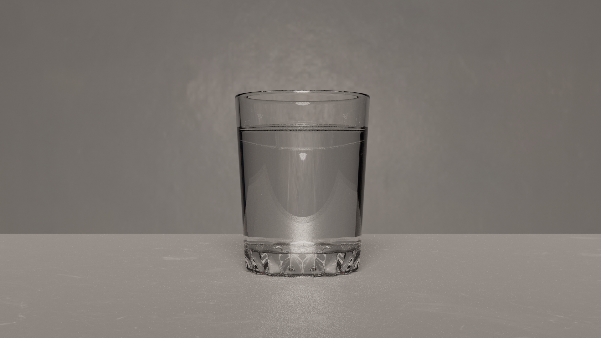
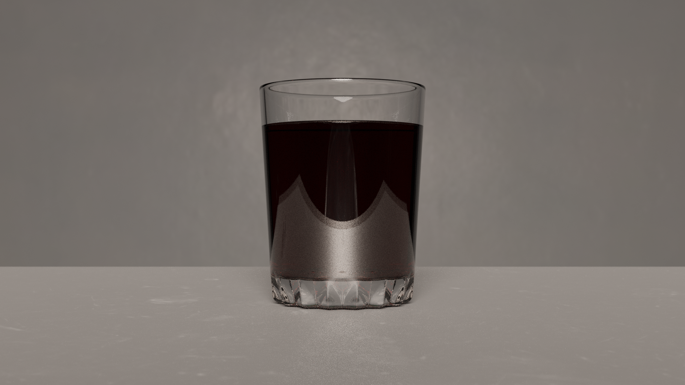
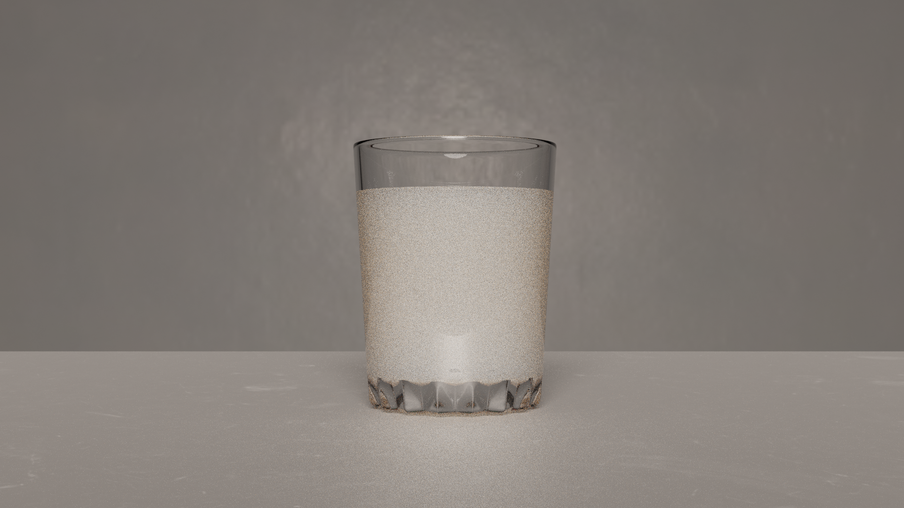
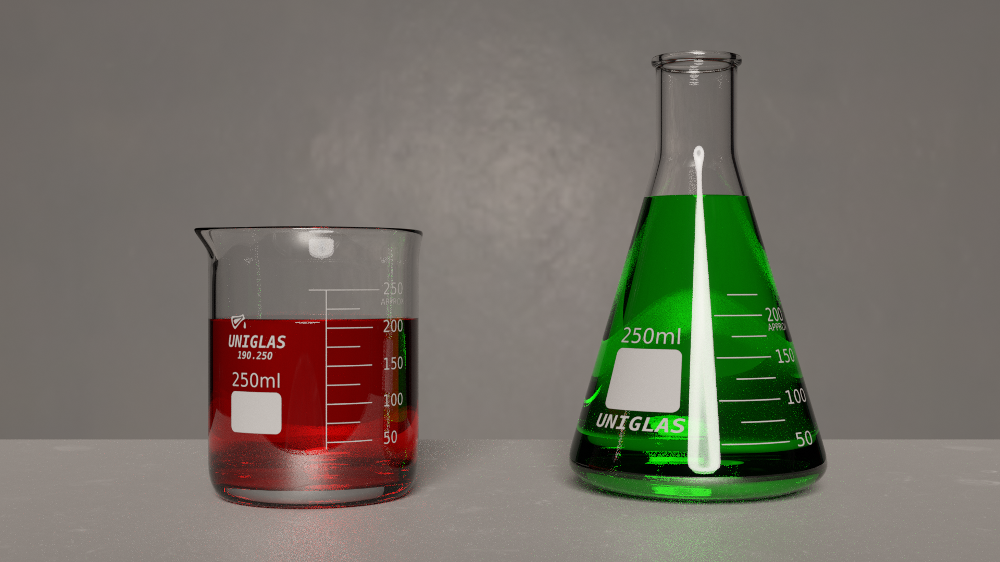
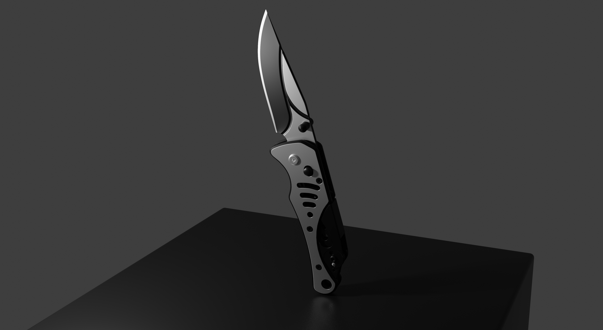
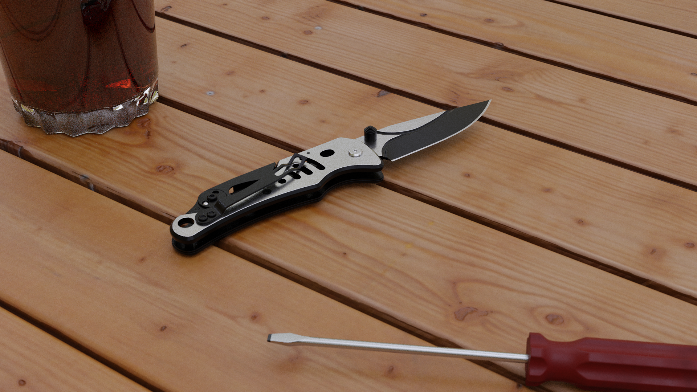

# CyclesExperiments

# Renders com o Cycles (Blender)
O Cycles é um path tracer baseado em baseado em física flexível capaz 
de diversos tipos de cenas com alta qualidade. Materiais podem ser 
criados usados shaders baseados em fisíca (Principled BSDF,
Principled Hair, Principled Volume) que podem ser ajustados, 
ou com o sistema de nós, para criar diversos tipos de materias.
Imagens geradas pelo Blender comulmente passam pelo Compositor, 
um sistema para pros processamento das imagens com uma interface 
de nós similar ao dos materais.

# Imagens
Todas as cenas foram renderizadas com Enviroment Maps, e os materiais
são baseado no Principled BSDF.

Tanto o vidro quanto o liquido tem 100% de transmissão.
glass IOR: 1.45, water: 1.33.

Para simular algo similar ao café o material possui absorção na transmissão
do material.

Para simular algo similar ao leite é usado 100% de subsurface scattering.

Todos os objetos de vidro possui o mesmo material que na verdade é dois
BSDFs combinados, um para o vidro e outra para a impressão no vidro, que
são combinados a partir de uma textura. Os objetos que não possui impressão
tem as coordenas de textura "fora" textura que possui a impressão (a textura
esta em modo clamp).

O material mesa é a único além do vidro que possui textura.
